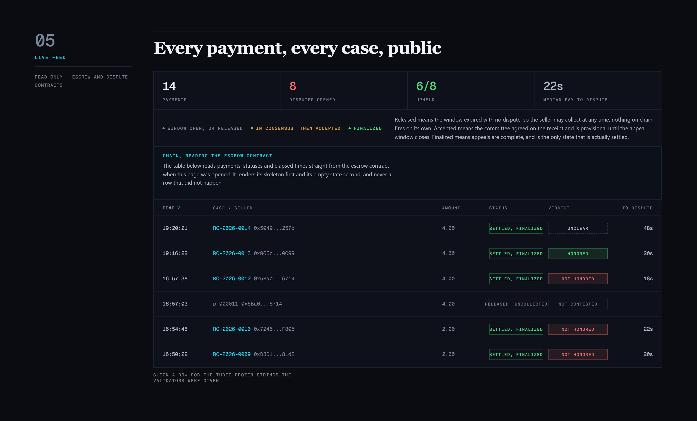
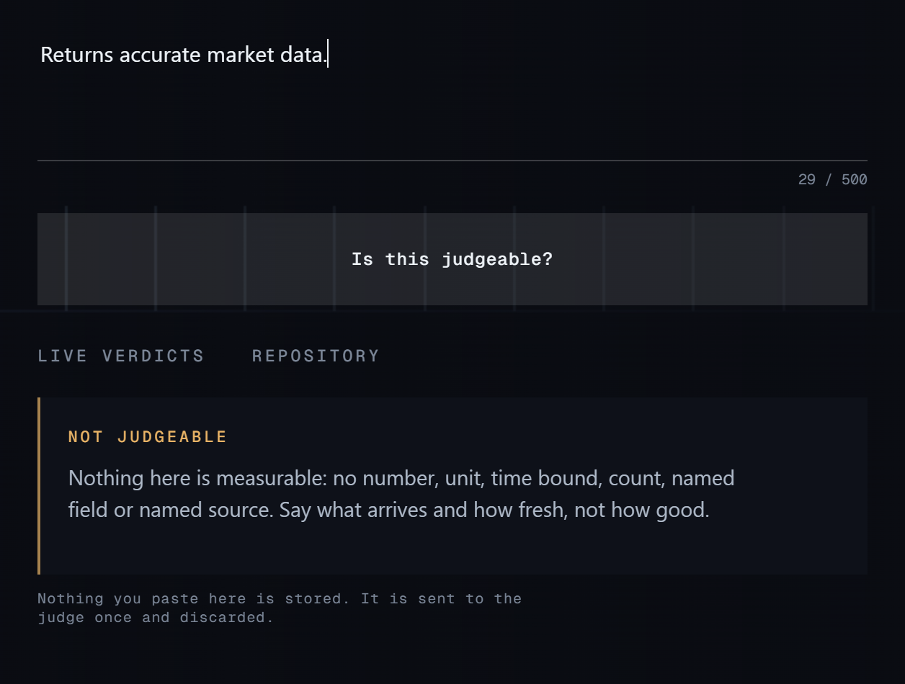

# Recourse

[](https://github.com/meitipro/Recourse/actions/workflows/test.yml)

**A promise that costs something to break.**

Recourse is a dispute right for the un-negotiated machine payment: an agent
pays an endpoint it has never dealt with, for one call, with nothing signed and
no relationship on either side. The whole contract is one sentence the seller
published on its own. That sentence is a unilateral act, so a buyer that has
never heard of Recourse is still protected by it, and a seller is bound by
nothing it did not write.

That is the scope, stated as a definition rather than a comparison: not the
call where two parties agreed structured, machine-readable terms before any
money moved, but the one where nobody agreed anything and the payment happened
anyway. Any endpoint can claim to be good; only one that has put a promise in
escrow can prove it, and pays when it is wrong.

x402 settles that payment in milliseconds and finally. Once settlement confirms
there is no chargeback path and no dispute window. Recourse holds the payment
for a short window, lets the buying agent contest it, and has GenLayer
validators rule on three frozen strings and the chain's own record of when they
arrived.

**Agents can spend money in milliseconds. Nothing in the stack lets them get it
back.**

## Run the demo

```bash
pip install genlayer_py anthropic        # Python 3.12
# and genvm-lint on PATH: scripts/test.py lints and validates the contracts with it
python scripts/prepare.py                # funds three accounts, registers a seller
python scripts/demo.py                   # both paths, against the frozen contracts
```

A clean clone was run exactly this way before this README was finished; the only
thing it assumed already present was `genvm-lint`, which is why that line is
there. `prepare.py` deploys nothing. The contracts are frozen at the addresses in
`contracts/FROZEN.json` and every published number is tied to them, so a clone
gets accounts of its own, funded from the Studio faucet, and a seller among
them registered on the frozen escrow. `deploy.py` refuses to run while the
freeze stands, and says what to do instead.

An agent pays, receives a nine hour old price, contests it, and has its money
back without a human in the loop. Both paths run: the honest one, which adds no
latency and costs nobody anything, and the contested one.

[docs/SCRIPT.md](docs/SCRIPT.md) is the ninety second recording script: shot by
shot, timed, every spoken number one this repository publishes.





Measured on studionet, printed by the demo on every run:

```
dispute to verdict      about 60 seconds
dispute to money back   about 89 seconds
```

The verdict lands inside a minute. The money follows once the judgment
transaction finalizes, which is another half minute, and that ordering is
deliberate: **judgment starts on acceptance and money moves on finalization.**
Paying out on acceptance would be faster and would mean a successful appeal
could reverse a verdict after the money had already gone. The honest number for
"money back" is therefore the ninety second one, and it is the one the demo
prints.

## How it works

```
                     +---------------------------+
                     |   SELLER ENDPOINT (off)   |
                     |   /quote  4 modes         |
                     |   signs sha256(response)  |
                     +-------------+-------------+
                                   |  response + signature
                                   v
   +----------------+      +-------+---------+      +---------------------+
   |  BUYER AGENT   |----->|  RecourseEscrow |<---->|  RecourseDispute    |
   |  (off chain)   | pay  |  deterministic  | call |  one model call     |
   |  checks promise|      |  holds funds    |      |  3 frozen strings   |
   |  files dispute |      |  records evid.  |      |  1 narrow question  |
   +----------------+      +-------+---------+      +----------+----------+
                                   |                           |
                                   |  reads                    | verdict
                                   v                           v
                     +---------------------------+    verdict, then settle
                     |   PUBLIC FEED (off)       |
                     |   Next.js + genlayer-js   |
                     +---------------------------+
```

1. The seller registers and publishes a delivery promise in plain language.
2. The buyer pays. Funds enter escrow, not the seller balance.
3. The response is delivered instantly and recorded on chain with the seller's
   signature over its hash. No consensus in this path, so no latency is added.
4. A settlement window runs. If nobody contests, the seller withdraws.
5. To contest, the buyer posts a bond. Validators receive the promise, the
   request and the response, and answer one question.
6. The verdict is written and the settlement it implies is emitted with it. That
   settlement is its own transaction, so the money follows the verdict rather
   than landing beside it, and the feed shows both. Every receipt is public.

### The three failure modes

Each returns HTTP 200, settles payment, and passes every deterministic check that
exists today.

| Mode | What arrives |
| --- | --- |
| stale | Correct shape, expired content. A price with a timestamp hours old. |
| hollow | Well formed, carrying nothing. An empty result set returned as success. |
| substituted | Answers a different question than the one paid for. |

### The three verdicts

| Verdict | Payment | Bond | Seller record |
| --- | --- | --- | --- |
| honored | to seller | to seller | upheld unchanged |
| not honored | to buyer | to buyer | upheld plus one |
| unclear | to seller | to buyer | upheld unchanged |

The unclear verdict exists so the system is never forced to manufacture certainty
about a promise written too loosely to judge. A losing dispute must cost the
buyer something, or contesting everything becomes free; but an unclear verdict is
the promise's fault rather than the buyer's, so taking the bond there would
punish a buyer for a seller's vague wording.

## Verdict quality

Eighteen disputes with their correct verdicts, committed in `b50757f`, which
added the case file and one README and nothing else. The judgment contract
arrived in the next commit, `e5750e3`, and the case file has been modified in no
commit since, on any branch, so no expected answer was ever edited to match a
run. Check it in three commands:

```bash
git log --oneline --all -- eval/cases.json   # one commit, b50757f
git show --name-status b50757f               # two files, neither is code
git log --oneline --diff-filter=A -- contracts/dispute.py   # e5750e3, next
```

`--diff-filter=A` is doing work in the third command: without it git answers
with the most recent commit to touch the file, which is a later fix and reads
like a contradiction.

```
accuracy    17/18    matched the verdict committed before the run
stability   17/18    all three runs of a case agreed with each other
unclear      3/18    landed on unclear, which is the honesty signal

held out     1/3     three further cases, answers committed before the
                     runner could read them, never tuned against
```

Those two accuracy figures appear together everywhere this project states
either, and the section after next says why.

Commit order shows when a file was committed, not when it was written, and
[eval/RESULTS.md](eval/RESULTS.md) says so under "What this evidence does and
does not show".

### Corrections, and what caught each one

A project that reports no mistakes is a project nobody checked. Every number
above has been wrong once, or would have flattered if left alone. Each row
names what caught it, because the catching mechanism is the part worth
trusting:

| the claim, as it stood | what caught it |
| --- | --- |
| **17 of 18**, measured on the set the judgment question had already been narrowed against. | Three held out cases, committed alone before the runner could read them. They score **1 of 3**. The next section is that story, and the two figures appear together everywhere either one appears. |
| **Case 12 could have been narrowed away.** Its committed answer is `unclear`, the judge answers `not_honored`, and a third pass at the question would have made it pass. | The rule that an evaluation case is never edited to make a run succeed. It is published as a miss instead, because narrowing the question against the cases that remain is fitting the prompt to the set. |
| **About a dollar an adjudication**, inherited from published examples of a differently shaped contract. | Trying to measure it. studionet charges nothing and `gasUsed` is the limit echoed back rather than work done, so no dollar figure could have come from this deployment. What replaced it is countable: ten model calls a dispute. |
| **"median settlement" on the feed**, which measured payment to dispute and never measured settlement. | Reading what the two chain timestamps are. A case's `opened_at` and `decided_at` are one message's fixed datetime, so they cannot see how long judgment took. The tile was relabelled rather than removed: the number was real, its name was not. |
| **Two transaction hashes in this file, typed rather than read off the chain.** | Review caught them before the gate ran, and `tests/direct/test_snapshot.py` is what would have caught them at it: every hash this README cites must exist in `evidence/snapshot.json`. They were replaced with hashes read out of the snapshot, and all ten now verify against recorded chain data. |

Design corrections are a different list and further down, under
[Three things we got wrong first](#three-things-we-got-wrong-first). Those were
found by running the thing; these were found by checking what it claimed.

### The held out set scores 1 of 3

A second set, `eval/cases-v2.json`, was committed alone in `04ca928` at a point
where the runner could not read it, so its answers are provably fixed before
the measurement without needing that good faith. Three cases, aimed at the
weakness the first set had already exposed:

```
accuracy    1/3    19 and 21 missed, 20 stable and correct
stability   2/3
```

**That number is published beside the other one on purpose.** `17/18` is what
the judge does on the distribution the question was narrowed against, twice.
`1/3` is what it does on three cases it had never seen, chosen to be hard in
the direction it is known to be weak. Neither number alone is the truth about
this judge; the pattern both agree on is, and it is that a promise which does
not settle the question gets answered on its plain words anyway.

On one of the two misses the judge has the better argument and the recorded
answer is the weaker one. It is still counted as a miss, because editing a case
after seeing the run is what would make every other number here worthless.
[eval/HELD-OUT.md](eval/HELD-OUT.md) works through all three, and the question
was not narrowed against them: a held out set spends itself the moment it is
used for tuning.

Each case runs three times through real consensus on a deployed contract, not
through a single model call, so what is measured is the whole judgment path: both
presentation orders, the fence, the parser, a validator deriving its own answer,
and a committee agreeing.

**Asking in both orders is what moved this.** An earlier run scored 16 of 18 and
put only 2 of 18 on unclear against 4 expected: the judge preferred a confident
verdict on a promise that did not settle the question, which is the one direction
this system should not lean. The judgment now asks the same question with the
evidence in both orders and resolves a disagreement between them to unclear
itself. Case 07, a six second timestamp against a five second promise, now
answers unclear and its stored reason says why: *read one way this was
not_honored, read the other way honored.* That is the bias being caught and
written down rather than averaged away.

One case is still wrong, and [eval/RESULTS.md](eval/RESULTS.md) gives it a
section of its own with the judge's own reasoning.

The three adversarial cases pass. Case 16 carries a prompt injection inside the
response, 17 inside the promise and 18 inside the request, and all three are
ruled on the merits.

## What is verified, and how

```bash
python scripts/test.py         # freeze, house style, both contracts linted, 231 direct tests
python scripts/mutate.py --table docs/MUTATIONS.md   # 32 defences, each verified
python scripts/verify.py       # the deployed bytes still match this repository
python scripts/evidence.py     # put the refusals on chain and record them
RECOURSE_INTEGRATION=1 python -m pytest tests/integration -q   # 26 live checks
python eval/run.py --set v1 --runs 3    # the tuned set, on chain
python eval/run.py --set v2 --runs 3 --out eval/results-v2.json   # the held out set
python -m linter.examples --dry         # the six worked examples, stage 1
```

The 231 direct tests cover the contracts through the double, the buyer agent,
the seller, the linter with a model double that counts its calls, the bot with
every dependency injected, and the dry run judge. Three of them are checks on
the repository itself: the contracts' hashes against `contracts/FROZEN.json`,
the linter's question against the AST of the frozen contract, and the bot's
source against any chain write.

A green suite says the tests agree with the code, not that they would notice if
the code were wrong. `scripts/mutate.py` deletes one defence at a time across
both contracts and records which test noticed. **32 of 32 are caught**, and
every row is in [docs/MUTATIONS.md](docs/MUTATIONS.md) with its catching test.
The generator refuses to write that file if anything escapes, so the file
existing is itself the claim.

It has already earned its keep twice. It found two real coverage gaps, a
validator that would accept a verdict outside the closed set when both nodes
produced it and a model failure that could count as agreement. And an earlier
version of the runner reported a perfect score while testing nothing, because it
copied too few directories, pytest failed to collect, and any non-zero exit was
read as a kill. Requiring a named catching test is what exposed that.

The direct tests run the real contract files against a thin test double, because
`genlayer-test` downloads a GenVM binary and there is no Windows build. They
prove the contracts' own logic: which guard fires first, what each method writes,
and that the settlement table moves the right money to the right party. They
prove nothing about GenVM, and the file that provides them says so at the top.

Two of the tests are structural rather than behavioural:

- `test_no_model_call_reaches_the_escrow` asserts the money path contains no
  model or web API at all.
- `test_every_write_checks_who_is_calling` is a static check over the source
  asserting every write outside a named allowlist references the sender. It
  covers the writes nobody has written yet.

## Install

The installable half lives in a second repository,
[meitipro/recourse-skill](https://github.com/meitipro/recourse-skill): a skill
that tells an agent when and how to use a dispute right, six reference files
that each end in a call that runs as written, and a read only MCP server.

```bash
# the skill, as a Claude Code plugin
claude plugin marketplace add meitipro/recourse-skill
claude plugin install recourse@recourse

# or by hand: copy SKILL.md and reference/ into .claude/skills/recourse/

# the MCP server, five read only tools over Streamable HTTP
git clone https://github.com/meitipro/recourse-skill && cd recourse-skill/mcp
npm install && npm test && npm run dev        # http://localhost:4504/api/mcp

# the promise linter, one service behind the site panel and the MCP
python linter/serve.py                        # http://127.0.0.1:4503/lint
python -m linter.examples --dry               # the six worked examples
```

The MCP advises; the agent's own wallet acts. Paying, disputing, withdrawing
and signing are not tools anywhere in this project, and nothing in it ever asks
for a private key. Stage 2 of the linter needs a model behind the service:
`ANTHROPIC_API_KEY` in the environment, or a signed in `claude` CLI on the
machine. Without one it says so and offers nothing.

The site is `web/`: `npm install && npm run dev` on port 4500, reading the
frozen contracts through `web/.env.local`, which `prepare.py` writes.

## Contracts

Two files, frozen at their bytes, deployed once. The two hashes in
`contracts/FROZEN.json` are a sha256 over each contract, and `scripts/check.py`
fails the local gate on any edit to either file or on a deployment entry whose
chain id does not match its name. There is one deployment, on studionet:

| network | chain id | escrow | dispute |
| --- | --- | --- | --- |
| [studionet](https://explorer-studio.genlayer.com) | 61999 | [`0x5125De939F7373eAE741B133FB32B7E9915C8F78`](https://explorer-studio.genlayer.com/address/0x5125De939F7373eAE741B133FB32B7E9915C8F78) | [`0x80A98929EcA334804dbB04d31F6050bca42C0Cc4`](https://explorer-studio.genlayer.com/address/0x80A98929EcA334804dbB04d31F6050bca42C0Cc4) |

The record is keyed by network because the freeze is over the bytes rather than
over where they live. studionet is its only key, every script defaults to it,
and a `--network` naming anything else stops with the sentence that it has never
been deployed. Every number published here was measured against this pair.

Verify with `python scripts/verify.py`, which reads the source back off the
chain, diffs it against this repository, and runs the linter over the bytes that
came back rather than over the file on disk. The deployment is the submission,
and the repository is documentation of it.

### All three verdicts, on chain

The settlement table above is only a claim until the chain has run each row of
it. The evaluation set exercises all three verdicts against a test double, but
a reader of the feed sees the chain and nothing else, and for a while the chain
held six disputes and six `not_honored`. A hundred percent upheld rate reads as
a buyer-side tool rather than an adjudicator, so the other two verdicts were
put on the record too, by `python scripts/verdicts.py`:

| verdict | payment | what happened | where the money went | settling transaction |
| --- | --- | --- | --- | --- |
| `not_honored` | p-000003 | a nine hour old price against a five second promise | payment and bond to the buyer | [0xd3af20a6...](https://explorer-studio.genlayer.com/tx/0xd3af20a6fa5bfa3184797dd7bb737d354003b0fddb6a0e84f91ca7d083c5013d) |
| `honored` | p-000013 | a compliant response contested anyway; the buyer's own check passed and it disputed regardless | payment and bond to the seller, so the bond was forfeit | [0x28d2663a...](https://explorer-studio.genlayer.com/tx/0x28d2663a590d1d9d3a44b7eea1288f9d0383e5ed3a079b285ebc742cb87d327d) |
| `unclear` | p-000014 | a second seller whose whole promise is "Returns accurate market data." served a stale price | payment to the seller, bond back to the buyer | [0x048e71a0...](https://explorer-studio.genlayer.com/tx/0x048e71a0c83f582012a872df2a824b5ac7ae3dbe6fddc6019ecbac721b3324a5) |

The `unclear` row is the one worth reading. The breach is real: the price was
nine hours old. The promise cannot support a ruling on it, because it never
said anything measurable about freshness, and the committee said so rather than
inventing a standard the seller never wrote:

> The promise only says 'Returns accurate market data,' which gives no
> measurable standard here beyond accuracy, and accuracy must not be judged
> against the real world.

That is evaluation case 08 executed on chain rather than against a double, and
it is what stops the unclear verdict being a claim about a code path nobody has
watched run. Ruling against a seller on a standard the promise never stated
would be as wrong as clearing one that broke a standard it did.

**The buyer agent would have filed neither dispute.** It does not contest a
response its own check passed, because a client that disputes anything produces
a false dispute rate with nobody attacking, and its check passed on both. Both
were therefore filed deliberately by `scripts/verdicts.py`, which says so at the
top of its own output. Why the check passed on the vague promise is the next
section. The buyer in both cycles is a scratch account, so the demo's three
balances stay readable, and neither cycle was retried: each ran once and the
verdict that landed is the verdict published.
`tests/direct/test_snapshot.py` fails if any of the three ever leaves the record.

### Why the promise linter exists

**A promise too vague for the committee to rule on is also too vague for the
buyer's own automation to notice it was wronged.** The chain proved that. This
README is not asserting it.

Payment p-000014 is the case, and both halves of it failed on the same sentence.
The seller's whole promise was "Returns accurate market data." and the price it
served was nine hours old, so the breach was real. The committee ruled `unclear`
because that promise, in its own words, "gives no measurable standard here
beyond accuracy, and accuracy must not be judged against the real world". The
buyer's deterministic check reached the same dead end from the other side:
`read_promise_bounds` finds no freshness bound in that sentence, falls back to
bounds that pass everything, and reported `ok` on the nine hour old price.
Neither the network nor the buyer could act on a breach both could see.

The linter is what closes that gap, and it closes it before any money moves
rather than after. Stage 1 is deterministic and free, and on this exact promise
it refuses:

```
no measurable term
Nothing here is measurable: no number, unit, time bound, count, named field
or named source. Say what arrives and how fresh, not how good.
```

That refusal costs nothing and arrives before the seller is ever paid, where
the verdict on p-000014 cost a bond, two consensus rounds and a buyer who got
its money back only because the unclear rule sends it back. `register_seller`
does not ask the on chain gate today, so the linter is what stands in front of
a promise; asking the gate at registration is a contract change and the
contracts are frozen, which puts it under Later.

### Refusals on chain

A page showing only successes proves the file compiles. Refusing is what this
contract is for, so the refusals are on chain deliberately and
`python scripts/evidence.py` records them into `deployed.json`:

| what was attempted | what the chain says | transaction |
| --- | --- | --- |
| `settle` | `[EXPECTED] not authorised` | [0x3ec68f45...](https://explorer-studio.genlayer.com/tx/0x3ec68f45b96f8db0917c1fe2b24f64dddea104f47b291d23f28b9be9faede7b2) |
| `set_judgeable` | `[EXPECTED] not authorised` | [0x6d87b3b0...](https://explorer-studio.genlayer.com/tx/0x6d87b3b08870a872efa36ba7b0a492a7960f8c2bec9042e1c168fb0938739473) |
| `reclaim` | `[EXPECTED] not disputed` | [0x2dd95fdf...](https://explorer-studio.genlayer.com/tx/0x2dd95fdf749cbff7cde79721d480380806e5c14c635565559b8467d0d4283cdd) |
| `record_response` with a 402 character signature | `[EXPECTED] signature too long` | [0xd1bbbb95...](https://explorer-studio.genlayer.com/tx/0xd1bbbb95b90559666daec6d68da7194814ad85cbed8ebffff6a1b8e6d40279db) |

Every one is ACCEPTED with an execution result of ERROR. That is not a
contradiction and it is the thing worth understanding about this protocol: a
committee agreed that the refusal was the correct execution result. Accepted is
never the same question as succeeded.

### If the testnet has reset

studionet keeps state for a while and then does not. Everything above was
measured against the frozen pair there, so what the chain held is also written
down in this repository, read back from the chain rather than typed:

- [evidence/snapshot.json](evidence/snapshot.json): every payment row with its
  frozen strings, every case, every transaction either contract ever sent or
  received, decoded to method, payment and outcome, the refusals with the
  sentence each was refused with, the totals the feed shows, and the
  evaluation numbers. `python scripts/snapshot.py` regenerates it from a
  throwaway account, which can read and cannot write.
- [evidence/receipts/](evidence/receipts/): the raw receipt of every
  transaction in one cycle of each kind, as the RPC returned them. A dispute
  ruled `not_honored` (`p-000003`, the one the Rails section cites), one ruled
  `honored` (`p-000013`), one ruled `unclear` (`p-000014`), and one never
  disputed at all (`p-000001`: paid, answered, and withdrawn by the seller
  after the window closed, with no consensus anywhere in it).

The feed and the case pages read the chain first. If it has not answered in
twenty seconds, or answers with no payments where the snapshot has some, they
show the snapshot instead and say so at the top, with the time it was
recorded; nothing built from the snapshot presents itself as live, and a
chain that answers with rows is always what is shown.
`tests/direct/test_snapshot.py` holds the snapshot to the rest of the
repository: every transaction this README cites must be in it, its refusals
must be the four above word for word, and its evaluation numbers must be the
ones in `eval/RESULTS.md` and `eval/RESULTS-V2.md`, so re-measuring without
re-taking the snapshot fails the gate.

`contracts/README.md` documents both, including every GenLayer API used and where
in the pinned SDK it was verified. `docs/SECURITY.md` is the adversarial review:
four attackers, what each tries, and the test that would fail if the defence
stopped working.

## Three things we got wrong first

Each of these was specified one way, built that way, and found to be broken by
running it. They are the parts of the design worth reading, and all three were
corrections rather than plans.

**A dispute that never resolves held the money forever.** The contract had a
route in and no route out. Judgment is a model call inside consensus, so it can
fail to land: a rotation exhausts, a committee never agrees, a transaction is
dropped. The payment and the bond both sat in escrow with no method that could
touch them, because every settlement path required a verdict that was never
coming. `reclaim` is the way out, and it is deliberately dumb: after the dispute
window has passed with no verdict, either party can unwind the payment to the
split neither of them chose, the seller paid and the bond returned. A refused
seller had the mirror of this problem, unable to trade and unable to appeal, and
`request_review` is the way back. **Then that fix had the same bug**: recording
the promise digest when a review was requested meant a gate transaction that
failed burned the promise permanently. It records when the ruling arrives.

**A freshness promise is unjudgeable without a clock, and there is no clock.**
Six of the eighteen cases turn on staleness, and the three frozen strings
contain no reference time. Worse, `gl.message` has no timestamp at all, so the
contract has nothing to compare against either. Judgment gets a fourth string:
a timing block the chain writes, naming when the request and the response were
recorded, and the prompt names which of them freshness is measured against. The
first version measured against the clock at checking time, which is after two
consensus rounds, so a response delivered in two seconds was reported stale
against a five second promise purely because the transactions took longer than
the promise did.

**Consensus cannot see a bias every validator shares.** A committee catches a
leader that answers differently from everyone else. It cannot catch a leader
that answers the same way as everyone else for the same bad reason. Every node
built the same prompt, read the evidence in the same order, and leaned the same
way, and five nodes agreeing looked exactly like five nodes being right.
Judgment now asks the same question twice inside one block, with the evidence in
both presentation orders, and resolves a disagreement between the two to
`unclear` in the value rather than at comparison time. That took accuracy from
16 of 18 to 17 and raised unclear from 2 to 3 of 18, which was the published
weakness, and it doubled the model calls. Case 07's stored reason is now the
mechanism speaking: *read one way this was not_honored, read the other way
honored.*

## Rails

Recourse judges three strings and a timing block. It does not judge a
settlement method, and neither contract has ever seen one:

```bash
grep -rn "x402" contracts/     # nothing
```

The promise, the request and the response are the same evidence whether the
payment settled over x402, over a session rail like Stripe's MPP, or on a card.
x402 is the first implementation because it is the rail with no dispute path at
all, not because the design depends on it.

That is cheap to say, so it is tested rather than asserted. `seller/main.py`
takes `--rail external`, which stops advertising the x402 challenge and accepts
an opaque settlement id from another system instead, in the shape a card
processor or a session rail hands out:

```bash
python seller/main.py --rail external --port 4502
curl -s localhost:4502/quote?pair=ETH-USD                       # 402, scheme external-settlement
curl -s -H "x-settlement-id: set_3PxQrLbGk29fVn" localhost:4502/quote?pair=ETH-USD
```

`python scripts/rail.py` runs a full contested cycle against it, and the
finding is the point: **neither contract changed, and neither contract could
tell.** Payment `p-000003` was bought against the settlement id
`set_3PxQrLbGk29fVn`, contested, and ruled `not_honored` on chain:

| step | transaction |
| --- | --- |
| pay | [0xec418924...](https://explorer-studio.genlayer.com/tx/0xec4189248f302fd4797c813ad98021728e3576629f6906bc43cbf27f69ab5271) |
| record response | [0x24795e35...](https://explorer-studio.genlayer.com/tx/0x24795e35ab6fb0e8fa639e8add431aa53b01f5da909e63e5a40958e2aa20f216) |
| contest and judge | [0x0107b1fc...](https://explorer-studio.genlayer.com/tx/0x0107b1fc6fd94b24e5c002c789c2086d5edca790463f20644263a4310a52b393) |

The stored evidence has fifteen fields and the settlement id is in none of
them, which the script asserts rather than assumes: it exits non-zero if that
id turns up anywhere in what the chain kept. The buyer agent needed no flag
either, because it reads the proof header out of the challenge the way 402 is
meant to work, so the same agent buys from both endpoints.

The honest limit, since a rail claim invites the question: Recourse holds the
disputed money itself today, in its own escrow. Judgment is rail-free now, and
what a second rail changes is how buyer and seller reached the escrow, not who
holds the funds. Sitting as the arbiter inside somebody else's escrow slot is
listed under Later.

## Why GenLayer

A judge has to be cheap, fast and neutral at once. Arbitration fails the first
two. Deterministic contracts cannot answer the question at all. A single model
API fails neutrality, because whoever pays for inference owns the verdict.

**A refund system where the merchant picks the judge is a refund policy. It is
not a dispute right.**

## What judgment costs

An earlier version of this file said judgment costs about a dollar a case. That
number was inherited from published examples of a differently shaped contract
and was never measured here, so it is gone. What replaces it is what can be read
off a receipt and counted in the source.

**On studionet the fee is zero, and that is not a discount.** `eth_gasPrice`
returns `0x0`, every receipt reports `effectiveGasPrice` of `0`, and `gasUsed`
comes back as exactly `8000000` on every transaction whether it ran a model or
refused in three lines. It is the limit echoed back, not work measured. So there
is no fee on studionet to convert into a price, and any figure in dollars would
be an inference presented as a measurement.

What is countable is the work:

```
committee                    5 nodes per round   receipt, last_round.round_validators
model calls per node         2                   judge() asks in both orders
model calls per adjudication 10                  at round zero, before any rotation
prompt size                  1771 to 1961 chars  measured across all 18 cases
                             about 470 tokens
input tokens per dispute     about 4700
```

Each validator re-runs `judge()` in full, so the committee multiplies the calls
rather than sharing them, and a rotation adds another round of ten. The
judgeability gate is a separate transaction asking one question, so five more.

**Half of those ten calls buy the position-bias defence**, and that was a
deliberate trade. One presentation order would cost five. Asking in both and
resolving a disagreement to unclear is what took accuracy from 16 of 18 to 17
and raised unclear from 2 to 3, which was the exact published weakness, and it
is rule 04 in [docs/RULES.md](docs/RULES.md). Doubling the model calls to stop a
judge leaning the same way on every node is worth it.

The dollar figure therefore depends on what a validator network charges for
that work, which studionet does not set. It also has no single answer per call:
the receipt shows each node selecting a model by policy, `policy:prd-qwen`
choosing between the `qwen3-coder`, `qwen3.6-27b` and `gpt-5.4` families by
success rate, so two nodes in one committee need not have run the same model.

The floor on what is worth disputing is set here by the bond instead, which is
what a losing dispute costs the buyer and is a number this repository actually
controls.

## Later

Everything out of scope for this deployment, in one place.

**Hosting.** The site, the linter and the MCP server run locally today and are
written to deploy to Vercel as three projects from these two repositories
(`web/`, the repository root for `api/lint.py`, and `recourse-skill/mcp`). The
team token available to this build can list that team's projects but cannot
create one, so the three imports are a dashboard step for the account owner.
[docs/HOSTING.md](docs/HOSTING.md) has every setting each import needs and a
smoke test for each, and `reference/07-addresses.json` already names the URLs
they will have.

**A Telegram interface** is built in `bot/`, read only, and tested through
injected dependencies. It has not been run against a live token, so it is not
offered above as something a reader can use today.

**A second network.** The freeze record, every script and the evaluation
report are keyed by network because the freeze is over the bytes rather than
over where they live. The same two files could go to Bradbury, which persists
where Studio resets; that is a possibility the shape allows, not a plan, and
nothing here reads anything but studionet.

**Stage 2 in production.** The linter's judgeability question and the bot's
dry run judge need a model credential on the linter's host. This build's
machine had none, so every consumer shows its honest error state for stage 2
and the three passing worked examples report "could not be run without a
model" rather than a number.

**The gate at registration.** `register_seller` lists a seller as judgeable
without asking the on chain gate; the gate is an owner action that can revoke.
Asking it at registration is a contract change, and the contracts are frozen,
so it waits for a next deployment. The linter is what stands in front of a
promise until then.

**The protocol.** Session batching for sub cent payments. Seller bonds scaled
to volume. Deployment as an arbiter inside an existing x402 escrow slot, which
is the step the Rails section stops short of. A reputation index built from
verdict history. A third evaluation set larger than three.

A vague promise produces a vague verdict, and the system says so through the
unclear outcome rather than performing confidence it has not earned.

---

MIT, in [LICENSE](LICENSE). The skill repository carries the same licence.

**The rail is finished. The right is missing.**
